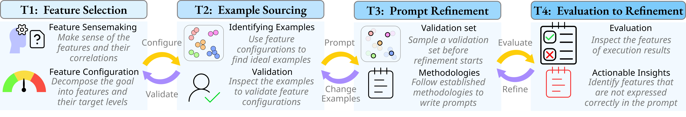

# Awesum
This is the open-source repository for 2024 VIS submission: **Towards Dataset-scale and Feature-oriented Evaluation of Large Language Model Prompts**: [https://doi.org/10.1109/TVCG.2024.3456398](https://doi.org/10.1109/TVCG.2024.3456398). 

### Feature-oriented Workflow
We introduce a feature-oriented workflow for dataset-scale prompt evaluation.




### System Overview
`Awesum` is an implementation of the workflow on `text summarization`.
<figure >

<!-- <figcaption> An overview of Awesum.  </figcaption> -->
</figure>
<!-- <figcaption >Actions done by Alice in the case study. 
    Alice uses the Feature Selection View (a) to decompose the summarization goal ``appeal to teenagers'' into feature configurations \inlineTbox{T1}.
    After setting the configurations, the system finds the closest cluster in (b) and highlights them in a green bubble. She uses Recommendation View (d) to validate the examples and adjust the feature configurations in (c) \inlineTbox{T2}. 
    Then, she moves on to Prompt Editor View (e) and writes the first prompt according to the feature configurations \inlineTbox{T3}, with the help of the prompt suggestions given by a chatbot.
    She executes the first prompt and uses the Prompt Comparator View (f) to compare it with the baseline prompt, which provides visual tracking of all the versions of prompts. 
    From the Bubble Plot (h1), she can see that the prompt written by Alice is performing badly, as the dark and light gray bubbles are overlapping and not close to the green bubble.  
    She goes to the dot plot (g) and finds that complexity and length are not satisfied, as many validation cases are falling out of the green bars. 
    She refines the prompts by adjusting how she expresses complexity and length \inlineTbox{T4}, and the new prompt yields much better performance (h2), as the dark gray bubble overlaps significantly with the green bubble, and most of the curves are yellow.</figcaption> -->

## Launching the application locally
Awesum has a Flask back-end and a vite front-end. They need to be launched separately.

### Backend
Navigate to `server/` and run:
```shell
pip install -r requirements.txt
```
These packages need extra care:

OpenAI:
```shell
pip install --upgrade openai 
```
Spacy:
```
pip install spacy
python -m spacy download en_core_web_sm
```
Or if you're using M1:
```
pip install 'spacy[apple]' 
python -m spacy download en_core_web_sm
```
Finally, 
```
# directory: server/ 
flask run
```
The backend server should then be listening to `localhost:5000` by default.
### Front-end
```
npm i
npm run dev
```

### Credits to the developers of these packages/repositories
`Backend`: 
[**Flask**](https://flask.palletsprojects.com/en/3.0.x/)

`Frontend`: 
[**Svelte**](https://svelte.dev/),
[**MeltUI**](https://melt-ui.com/),
[**TailwindCss**](https://tailwindcss.com/),
[**Lucide**](https://lucide.dev/),
[**D3**](https://d3js.org/),
[**Vite**](https://vitejs.dev/)

`Dataset`: 
[**BBC**](http://mlg.ucd.ie/datasets/bbc.html)

`Computational Linguistics`: 
[**Spacy**](https://spacy.io/),
[**VADER**](https://github.com/cjhutto/vaderSentiment),
[**Textstat**](https://github.com/textstat/textstat),
[**Lexical Diversity**](https://github.com/kristopherkyle/lexical_diversity),
[**scikit-learn**](https://scikit-learn.org/stable/)

`Intelligent Agents`: 
[**OpenAI**](https://openai.com/)

## Source Code paths
### Frontend
`src/*`

### Backend
1. Flask server: `server/app.py`
2. Feature metrics: `server/metrics/stylistic.py`
3. Prompts: `server/AnalysisUtils/gpt.py`
4. Clustering: `server/AnalysisUtils/clusters.py`
5. Dimensionality Reduction: `server/AnalysisUtils/dr.py`
6. Data: `server/data/prod/*`

